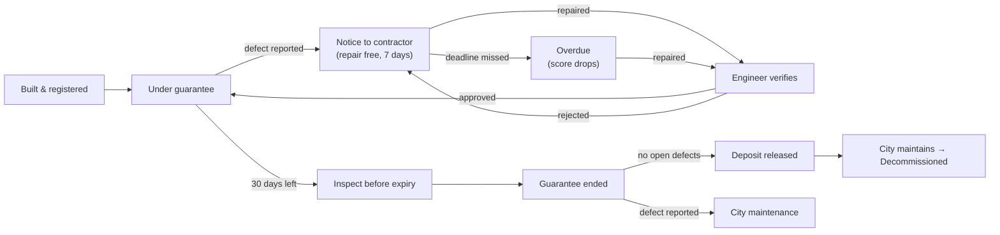

# Jawabdari · जवाबदारी · જવાબદારી

**Every public work carries a guarantee. Jawabdari makes sure cities never pay twice to fix it.**

🔗 **Live app:** https://jawabdari-amc.streamlit.app
&nbsp;·&nbsp; Built for the Pravi *Build for Billions* hackathon, 28 Sep 2026

---

## The problem

When a contractor builds a road, bridge, drain or building, the contract includes a **Defect Liability Period (DLP)**. If the work breaks during that period, the contractor must repair it **free**, and the city holds the contractor's **security deposit** until the period ends.

In practice nobody tracks it. A road built eight months ago develops potholes in the monsoon, the city pays a second contractor to fix it, and the original contractor's deposit is quietly released.

In **August 2026, Ahmedabad Municipal Corporation's Road & Building Committee** found civil-work proposals worth crores floated *without* a DLP clause, called it a serious lapse, and made DLP mandatory in every tender:

| Work value | DLP |
|---|---|
| Up to ₹1 crore | **12 months** |
| Above ₹1 crore | **36 months** |

Source: [Gujarat Samachar, Aug 2026](https://english.gujaratsamachar.com/news/ahmedabad/amc-committee-flags-tender-irregularities-orders-defect-liability-clause-in-every-project-43595036798)

A rule on paper only helps if someone applies it every day. **Jawabdari answers one question for every public work, at every moment: *who is responsible for fixing this right now?***

## Who it is for

| User | What Jawabdari gives them |
|---|---|
| **Citizen** | Scans a QR code on site: who built it, what it cost, guaranteed until when. Reports a problem in English, हिन्दी or ગુજરાતી. No login, any phone. |
| **Ward engineer** | Registers completed works (the guarantee is calculated automatically) and verifies repairs. |
| **Contractor** | Sees repair notices with a 7-day deadline and marks them repaired. |
| **Accounts department** | Can release a deposit **only** when the guarantee has ended and nothing is pending. |
| **Commissioner** | Dashboard: money saved, guarantees expiring soon, contractor reliability, map. |

## Features

- **Register work + QR code:** the guarantee end date and the 5% deposit are calculated from the AMC rule. A printable QR code opens the Public Board.
- **Instant liability check:** every reported defect is routed automatically:
  - still under guarantee → notice to the **contractor**, repair free within 7 days
  - guarantee over → **city** maintenance queue
- **Contractor desk:** notices show green "days left" or red "OVERDUE" badges. Engineers approve a repair (closed) or reject it (a fresh 7-day notice is sent).
- **Deposit release guard:** release is blocked while the guarantee is running or any defect is unresolved.
- **"Inspect before expiry" alert:** lists works whose guarantee ends within 30 days, because a defect found after expiry is the city's cost.
- **Contractor reliability score (0–100):** feeds future tender decisions.
- **Public Board:** a mobile-first transparency page with star rating, open problems and a full history timeline.
- **Three languages:** English, Hindi and Gujarati on all citizen pages.
- **Audit trail:** every step is written to an append-only `events` table and is never edited.
- **India time everywhere:** dates are calculated in IST even on UTC cloud servers.

## Lifecycle of a public work



## Architecture


Details and the Mermaid source are in [`docs/ARCHITECTURE.md`](docs/ARCHITECTURE.md).

- **Today:** Streamlit (5 pages) → `services.py` (all business rules as plain functions) → SQLite, deployed on Streamlit Community Cloud.
- **At India scale:** the same functions behind stateless FastAPI services and a load balancer, with:
  - PostgreSQL + PostGIS partitioned by state/city, Redis cache, object storage for photos, and a message queue for notices
  - integrations with GeM (tenders), PFMS (deposit release), DigiLocker (identity), Bhashini (languages) and PM Gati Shakti (GIS)

## How the rules work

**Guarantee (DLP):** `cost ≤ ₹1 crore → 12 months`, otherwise `36 months`, counted from the completion date. The end date itself is still covered. Month-ends are handled, so 29 Feb 2024 + 12 months = 28 Feb 2025.

**Liability check** (`services.report_defect`):
```
if report_date <= dlp_end_date:  liable = Contractor, status = Notice Sent, deadline = report_date + 7 days
else:                            liable = City,       status = Open
```
A notice still unrepaired the day after its deadline becomes **Overdue**.

**Deposit release** (`services.can_release_deposit`): allowed only if the guarantee has ended **and** no defect is Open, Notice Sent, Overdue or Pending verification.

**Money saved:** the sum of repair values of closed defects the contractor was liable for, which the city did *not* pay.

**Contractor reliability score** (`services.contractor_scores`), based only on defects during the contractor's guarantee:
```
score = 100 − 5 × defects − 15 × overdue_or_late + 2 × closed_on_time      (clamped to 0–100)
```
Shown as a 0–100 bar on the dashboard and as 1–5 stars on the Public Board.

## Run locally

```bash
git clone https://github.com/jayni08/Jawabdari.git
cd Jawabdari
python3 -m venv .venv && source .venv/bin/activate      # Windows: .venv\Scripts\activate
pip install -r requirements.txt
streamlit run app.py
```
Open http://localhost:8501. Realistic Ahmedabad demo data (8 contractors, 40 works, 12 defects) is created automatically on first run. To reset it: `python seed.py`.

To scan QR codes with a phone while running locally, open the app using the **Network URL** printed in the terminal (same Wi-Fi). QR links always use the address you opened the app with.

## Run tests

```bash
pytest -q
```
There are **59 tests**:

| File | What it covers |
|---|---|
| `test_services.py` | Every business rule and its edge cases: exactly ₹1 crore, leap years, last day of the guarantee, overdue timing, deposit rules, score limits |
| `test_flow.py` | The full lifecycle story end to end |
| `test_pages.py` | Every page loads, plus key user actions, using Streamlit's `AppTest` |
| `test_db.py` | Database schema and ID generation |
| `test_i18n.py` | The three languages stay in sync |

## Project structure

```
app.py                 top navigation (entry point)
pages/                 0_Dashboard · 1_Register_Work · 2_Report_Defect · 3_Contractor_Portal · 4_Public_Board
services.py            ALL business rules (no Streamlit) - ready to expose as an API
db.py                  SQLite schema, indexes, ID generation
seed.py                deterministic Ahmedabad demo data
i18n.py                English / Hindi / Gujarati labels
ui.py                  shared look & feel (safe HTML helpers)
config.py              DLP rule, notice days, time zone, base URL
.streamlit/config.toml theme
tests/                 pytest suite
docs/                  architecture diagrams
```

## Assumptions

- The DLP starts on the **completion date**. The AMC thresholds (≤ ₹1 crore → 12 months, above → 36 months) apply to all asset types.
- The security deposit defaults to **5% of the cost** when not specified.
- A contractor gets **7 days** to repair after a notice.
- "Repair value" is the engineer's estimate of what the city would otherwise have paid.
- **Logins are simulated** (contractor chosen from a list). Production would use OTP and role-based access.
- **Demo storage is temporary:** Streamlit Community Cloud storage resets on restart, and demo data is re-created automatically. Photos are stored locally. Production would use PostgreSQL and object storage.
- Hindi and Gujarati translations should be reviewed by native speakers. Production would use Bhashini.
- Contractor names, phone numbers and GST numbers in the demo data are **fictional**.

## What next

1. **WhatsApp / SMS alerts** to contractors on notices and deadlines, and to citizens when their report is resolved.
2. **AI photo verification of repairs:** compare before and after photos to flag fake or poor repairs before approval.
3. **e-procurement (GeM) and PFMS integration:** import works and DLP clauses directly from tenders, and trigger deposit release payments automatically.
4. **Statewide contractor scorecard:** a public reliability rating used when awarding future tenders.
5. **Idle-asset exchange after the guarantee:** list idle equipment (road rollers, generators, water tankers) so other departments reuse it instead of buying new.

## AI tools used

AI assistants (Claude) were used to help generate boilerplate code, tests and documentation. The problem framing, rules, data model and features were designed, reviewed and tested by me.

---
*Jawabdari (जवाबदारी / જવાબદારી) means "accountability".*
