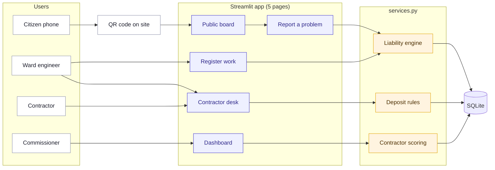
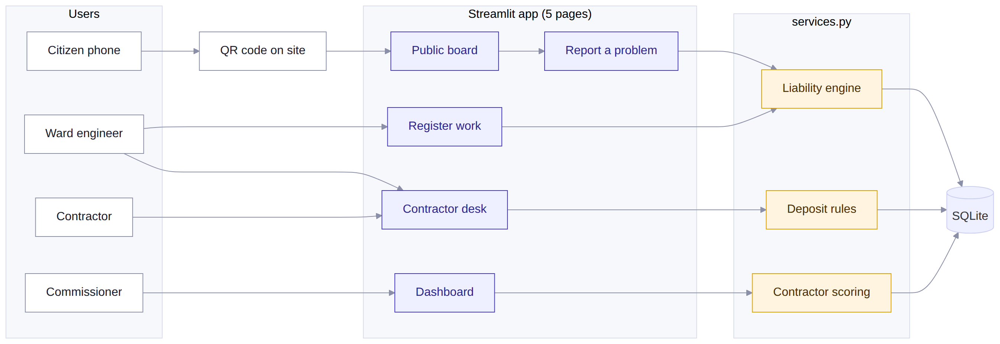
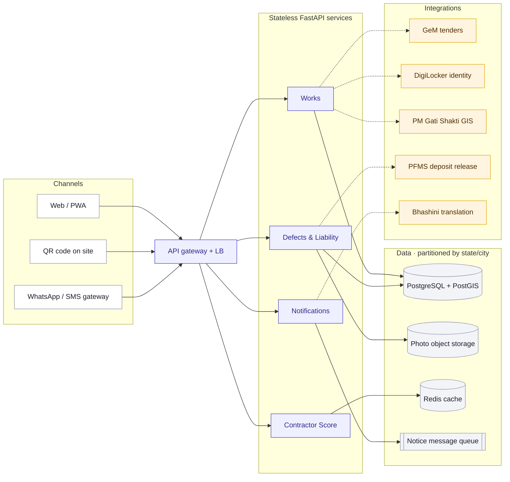
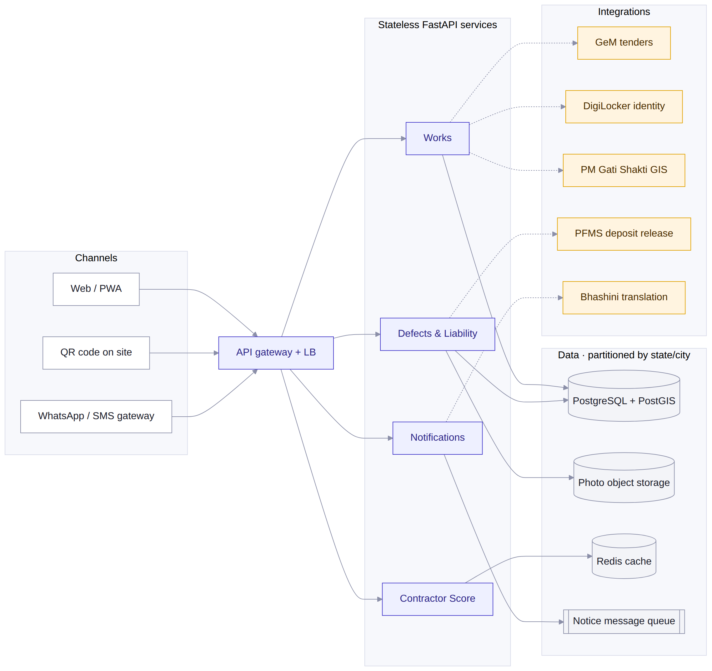

# Jawabdari — Architecture

## 1. Today's prototype (deployed at https://jawabdari-amc.streamlit.app)

Every page calls plain functions in `services.py`; all rules (guarantee, liability, deposit, score) live there and are covered by 59 automated tests.

## 2. Production at India scale

Same rules from `services.py`, exposed as stateless FastAPI services behind a load balancer, so capacity grows by adding servers. Data is partitioned by state/city; integrations plug into India Stack.

